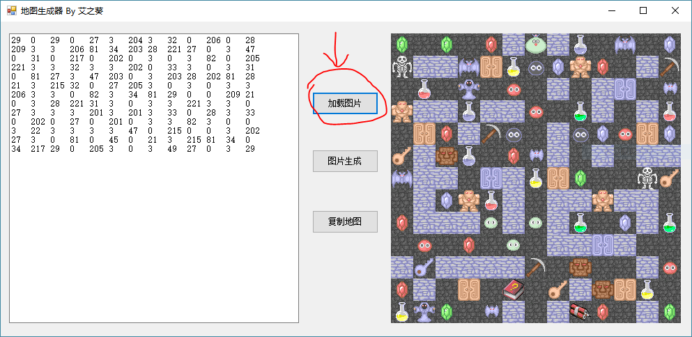

地图生成器
================

### 软件说明
本工具为[HTML5魔塔样板](https://github.com/ckcz123/mota-js)的一个子工具，能从一个截图中识别出地图数据。

Windows 8可直接运行本软件，Windows 7需要安装.Net Framework 4.0方能正常运行。

### 编译运行

请使用VS2012及以上进行编译运行。   
本软件可以任意进行修改成自己想要的样子。  

如果有问题，请邮件至 `ckcz123@126.com`，或在魔塔吧官方交流群中搜寻“小艾”以联系到我。  